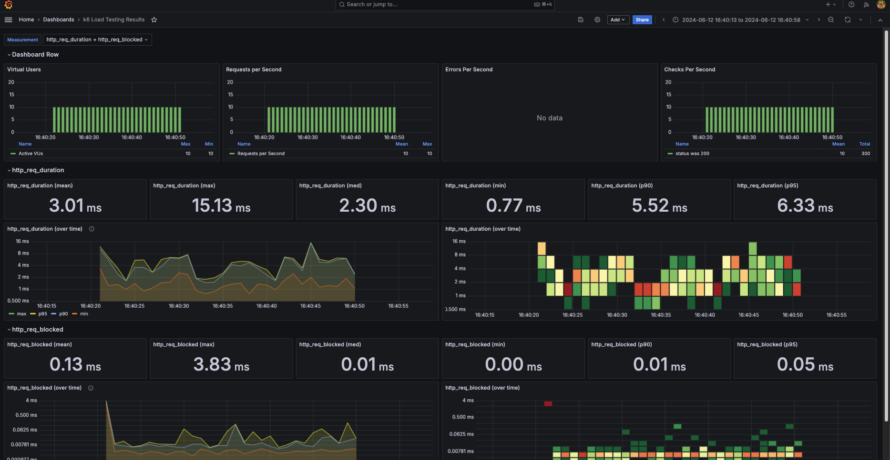

# Accessing Grafana
1.  Grafana Dashboard:
Open your browser and go to http://localhost:3001.
Log in with the default credentials (admin/admin).

2. Add InfluxDB Data Source:
Go to "Configuration" -> "Data Sources".
Click "Add data source".
Select "InfluxDB".

3. Configure the data source:
URL: http://influxdb:8086
Database: k6
Save & Test

4. Import k6 Dashboard:
Go to "Create" -> "Import".
Import a dashboard by entering the dashboard ID from Grafana.com (e.g., 2587 for a popular k6 dashboard).
Select the InfluxDB data source you added.

# Example dashboard preview
 
